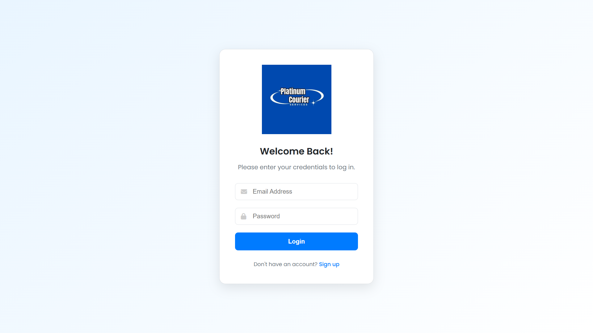
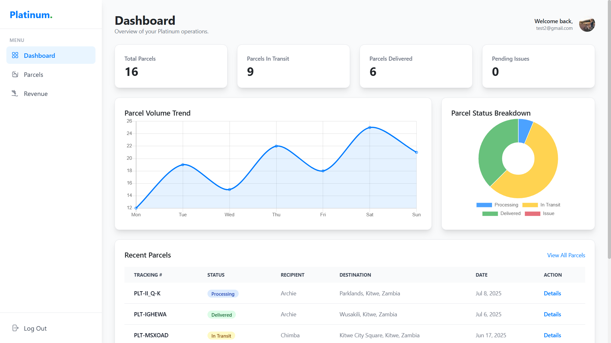
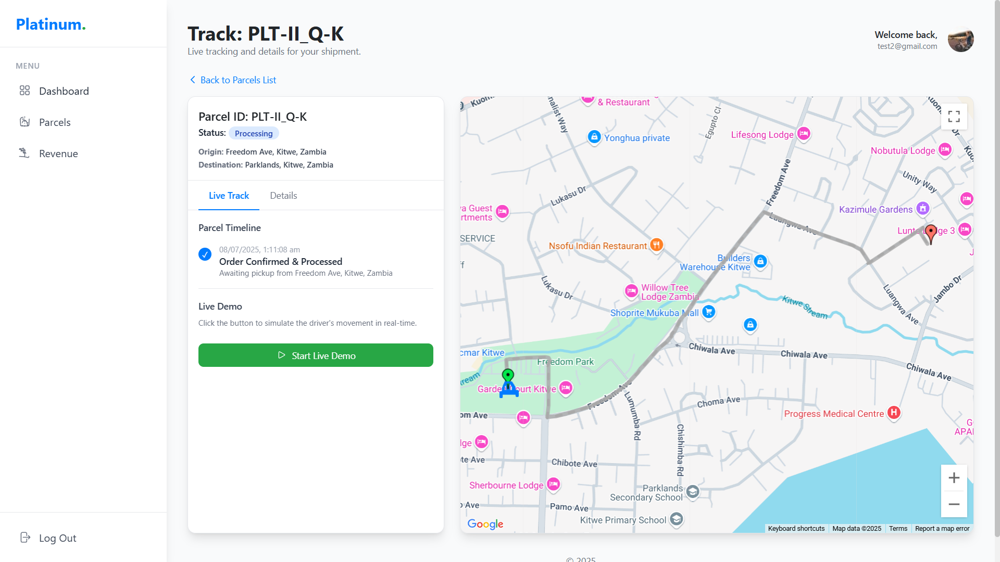
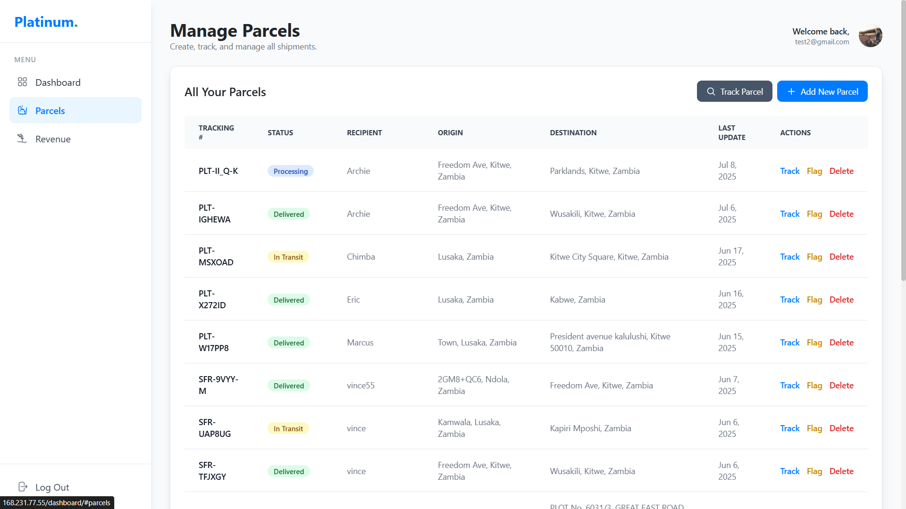
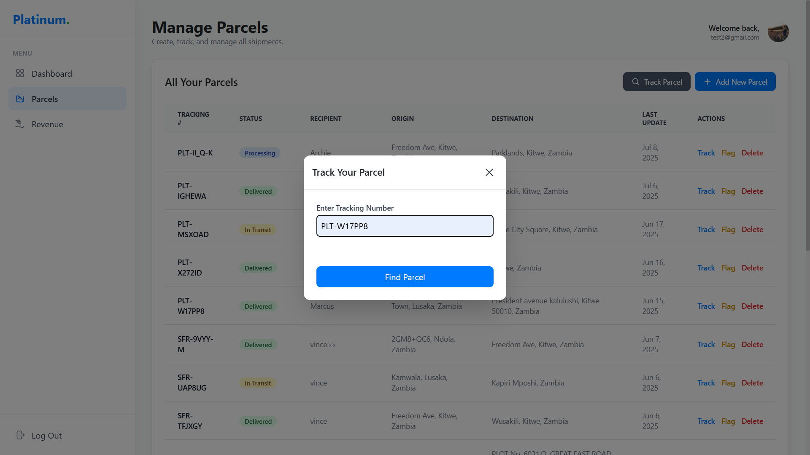
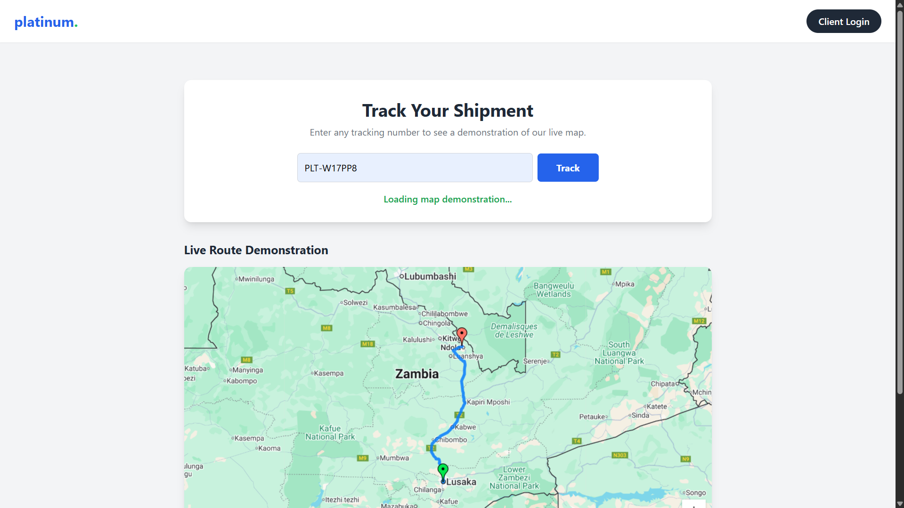
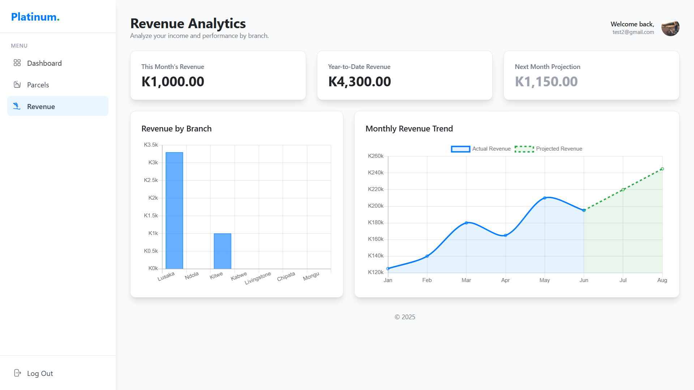

# 📦 Courier Web App

This is a **Courier Management Web Application** that enables real-time parcel tracking, efficient package management, and insightful delivery analytics. It is built for logistics teams, courier operators, and customers to streamline operations across delivery lifecycles.

## 🚀 Features

- 📍 Real-time parcel tracking via interactive maps  
- 📦 Add, update, and manage parcels  
- 🔍 Parcel search and lookup  
- 📊 Dashboard analytics for revenue and activity  
- 🔐 Secure user authentication  

---

## 📸 Screenshots

### 🛠️ Login


### 📊 Dashboard


### 💼 Parcel Management



### 🔍 Parcel Search


### 📍 Track Parcel in Real-time


### 💰 Revenue Insights


---

## 📂 Tech Stack

- **Frontend**: HTML, JavaScript  
- **Realtime**: Django / WebSockets  
- **Maps**: Google Maps API  

---

## 📌 How to Run

```bash
git clone https://github.com/yourusername/Courier-MVP.git
cd Courier-MVP
open index.html  # or run with your preferred local server
